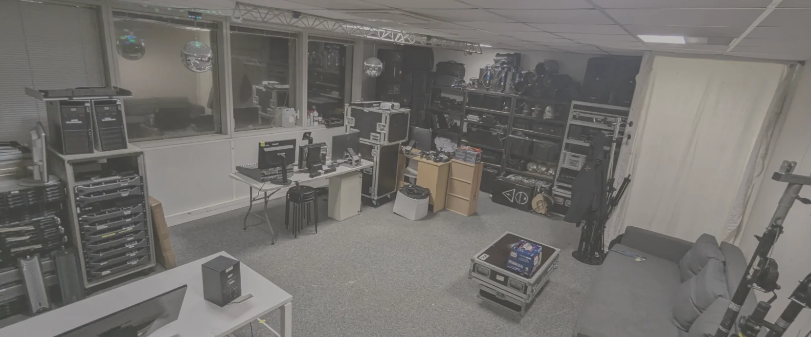
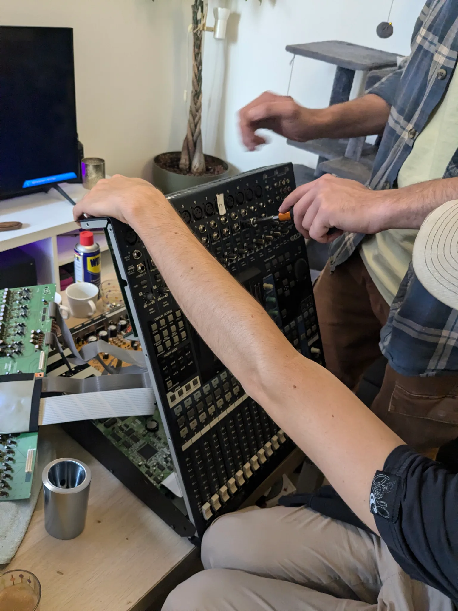
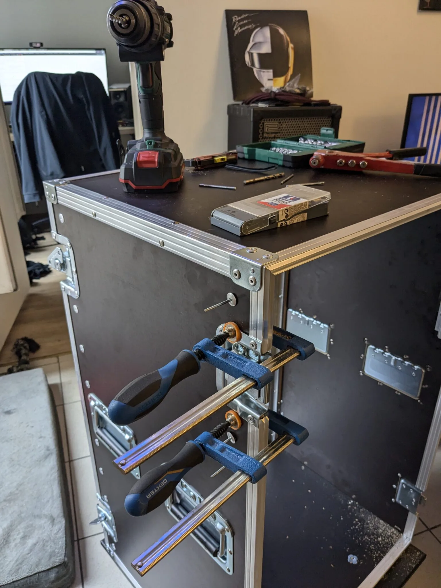

ElkaRec est une association engagée dans une démarche **d’écoconception**, avec pour mission de rendre l’audiovisuel plus **accessible, responsable et durable**. Nous créons et aménageons un studio de production et de post-production en récupérant et en revalorisant des matériaux que d’autres entreprises ou organisations cèdent lors du renouvellement de leurs équipements. Grâce à la **réparation** et au **réemploi** de ces matériaux, ElkaRec offre un espace prêt à accueillir techniciens, réalisateurs et passionnés, pour des projets collaboratifs et créatifs.

Notre association est un lieu où chacun peut non seulement **travailler** et **créer**, mais aussi apprendre et s’**initier** aux métiers de l’audiovisuel dans une **perspective écoresponsable**. En valorisant le matériel et les ressources locales, nous encourageons l’**économie circulaire** et offrons aux futurs talents un environnement inspirant et respectueux de l’environnement, au service de la création audiovisuelle.

## 🌱 Qu’est-ce que c’est l’écoconception ?

L’écoconception est une démarche visant à intégrer les enjeux environnementaux dans toutes les étapes de la conception d’un produit, d’un service ou d’un projet. L’objectif est de minimiser l’impact écologique dès la planification, en prenant en compte le cycle de vie complet (de la fabrication à la fin de vie) pour réduire les ressources utilisées, diminuer les émissions de gaz à effet de serre et limiter la production de déchets.

[Voir l’étude d’impact de l’éco-production audiovisuelle 2024 par Ecoprod](/https://drive.google.com/file/d/1zKBWNTSwdj9EIojPGn0pJqcFG3Il6Ll9/view?usp=sharing)

  

    <h3 class="font-bold text-white mb-3">La problématique</h3>
    

      Comment des associations comme la nôtre, en particulier dans le secteur de l’audiovisuel, peuvent-elles réduire leur empreinte environnementale et leurs coûts en intégrant l’écoconception dans leurs projets, sans compromettre la qualité ni l’accessibilité de leurs services ?
    

  

  

    <h3 class="font-bold text-white mb-3">L’enjeu</h3>
    

      L’écoconception permet de combiner « responsabilité écologique » et « durabilité financière ». En optimisant l’utilisation des ressources et en favorisant le réemploi, les associations peuvent réduire leurs coûts tout en renforçant leur engagement envers la préservation de l’environnement.
    

    

      Dans le secteur audiovisuel, cela signifie repenser les méthodes de production et d’événementiel pour limiter l’empreinte carbone, réduire les déchets et sensibiliser le public aux bonnes pratiques.
    

  

Pour nous, c’est également la possibilité de rendre accessible la création en mettant à disposition un lieu et du matériel audiovisuel. Plus concrètement, pour ElkaRec, cela signifie :

## Ecoconception de projet

**Minimiser les ressources** : Revoir la planification des projets pour limiter les matériaux nécessaires, en privilégiant le numérique lorsque cela est possible et en réduisant les impressions papier.

**Réutiliser et adapter** : Utiliser du matériel, des décors, ou des ressources déjà existants d’un projet à l’autre, afin de diminuer le gaspillage.

## Récupération & Réemploi de Matériaux

**Récupération de matériaux d’occasion** : Collaborer avec des entreprises, collectivités, ou autres associations pour récupérer du mobilier, des équipements ou du matériel technique que ces structures n’utilisent plus.

**Réparation et entretien** : Prioriser la réparation et l’entretien régulier des équipements (informatique, audiovisuel, etc.) pour prolonger leur durée de vie.

**Partenariats avec des ressourceries** : S’approvisionner en matériaux de seconde main (bois, métal, meubles, etc.) dans des ressourceries ou magasins spécialisés en récupération pour l’aménagement de bureaux ou de locaux.

  

  

  

  

## Sensibilisation & Formation Écoresponsable

**Former les membres et bénévoles** : Organiser des ateliers ou formations sur l’écoresponsabilité, pour sensibiliser les équipes aux gestes écologiques dans le quotidien de l’association.

**Promouvoir des comportements verts** : Encourager des pratiques comme le tri des déchets, l’utilisation de gourdes et de vaisselle réutilisable, et la réduction des déchets au bureau ou sur les lieux de tournage.

**Communication verte** : Adopter une communication qui valorise les engagements écologiques de l’association et sensibiliser les publics aux enjeux environnementaux.

# Ensemble, vers une production plus verte !

Nous sommes fiers de faire notre part pour la planète, mais nous savons qu’il reste encore beaucoup à faire. En tant qu’association de production audiovisuelle, nous croyons que nous avons un rôle à jouer pour construire un avenir plus durable et plus respectueux de l’environnement. Aidez-nous dans notre démarche pour une production audiovisuelle responsable ! 💚
